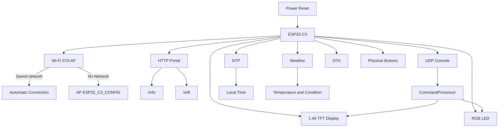
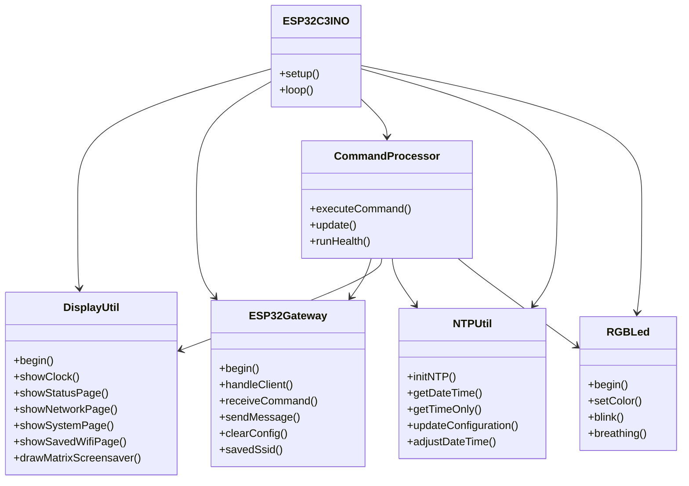
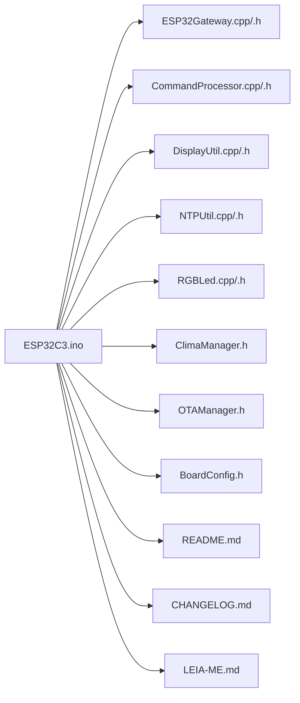

# ESP32-C3 Gateway


Gateway for **ESP32-C3** with a 1.44" TFT display, Wi‑Fi portal, UDP console, NTP, weather, OTA, and visual feedback through an RGB LED. The project has been organized to be clearer on GitHub, with complete documentation and architecture diagrams.

> Ideal for embedded automation, local dashboards, remote network control, and quick device monitoring.

## Highlights

- **1.44" TFT display** with clock, status, network, system, and saved networks pages
- **Wi‑Fi portal** with up to 5 persistent networks and circular list management
- **UDP console** for remote commands
- **NTP with timezone and DST** persisted in flash
- **Weather via Open-Meteo** with periodic updates
- **RGB LED** with status indication, blink, and breathing effects
- **OTA** when connected in station mode
- **Physical buttons** for navigation and long-press actions
- **Power-saving mode** with deep sleep via `desliga` command

## System Overview

# System Architecture



## Description

- **ESP32-C3** is the central controller.
- **TFT Display** shows status,

## Module Architecture



## Repository Structure



## Features

### Display Interface

- Main clock screen with date, time, and visual progress
- Status page with CPU, RAM, uptime, and NTP
- Network page with SSID, IP, channel, RSSI, and MAC
- System page with chip, memory, and firmware
- Saved networks page with active slot and connected network
- Console screen for command responses
- Matrix-style screensaver after inactivity

### Connectivity

- Automatic connection to the best available saved network
- Fallback to AP mode: `ESP32_C3_CONFIG`
- HTTP server with:
  - `/info`
  - `/wifi`
- UDP command reception
- OTA updates when connected in STA mode

### Power and Operation

- `desliga` puts the device into deep sleep
- LED indicates operating states
- Physical buttons enable navigation and critical actions

## UDP Commands

### System

- `help`
- `info`
- `status`
- `uptime`
- `reason`
- `version`
- `build`
- `alive`
- `reboot`
- `desliga`
- `temp`
- `cpu`
- `ram`
- `flash`
- `chip_info`
- `health`

### Network

- `net_info`
- `mac`
- `reset_wifi`
- `rssi`
- `ip`
- `ssid`
- `channel`
- `wifi_status`

### Time

- `time`
- `date`
- `ntp_status`
- `set_fuso:X`
- `set_time:YYYY-MM-DD HH:MM:SS`
- `dst_on`
- `dst_off`

### LED

- `led_on`
- `led_off`
- `led_breath`
- `led_pisca:P:I`
- `led_blink:I`

### Weather

- `clima`
- `clima_age`
- `clima_sync`

## Quick Usage Example

```bash
help
info
status
set_fuso:-3
set_time:2026-10-07 14:30:00
led_blink:500
clima_sync
health
```

## Hardware and Pinout

According to the current code:

| Signal | GPIO |
|---|---:|
| LCD CS | 2 |
| LCD DC | 0 |
| LCD RESET | 5 |
| LCD MOSI | 4 |
| LCD SCK | 3 |
| RGB LED | 11 |
| Page Button | 8 |
| BOOT Button | 9 |
| User Button | 10 |

## How to Compile in Arduino IDE

1. Install **ESP32 by Espressif Systems** (3.x series)
2. Select **ESP32C3 Dev Module**
3. Enable **USB CDC On Boot** if you want serial over native USB
4. Use a partition scheme with OTA support
5. Install **GFX Library for Arduino (Arduino_GFX)**
6. Open `ESP32C3.ino`, keeping all files together in the same folder

## Main Dependencies

- `WiFi.h`
- `Preferences.h`
- `time.h`
- `Arduino_GFX`
- `Open-Meteo` via `ClimaManager`
- Native ESP32 core support for OTA and networking

## Operational Flow

```mermaid
sequenceDiagram
    participant User as User
    participant Btn as Buttons
    participant Loop as loop()
    participant GW as ESP32Gateway
    participant CMD as CommandProcessor
    participant DISP as DisplayUtil

    User->>Btn: Press button
    Btn->>Loop: Update page / action
    User->>GW: Send UDP command
    GW->>CMD: Execute command
    CMD->>DISP: Print response
    CMD->>GW: Reply via UDP
    Loop->>DISP: Render current screen
```

## Changelog

See [CHANGELOG.md](CHANGELOG.md) for a complete and documented change history.

## Premium GitHub Presentation

This repository now includes a richer GitHub presentation with:

- top badges
- Mermaid diagrams
- architecture blocks
- visitor-oriented organization
- clear feature and usage descriptions

## Contributing

Pull requests and improvements are welcome. If you want, I can also turn this into a contribution workflow with issue templates and a development guide.

## License

No license has been defined yet.
