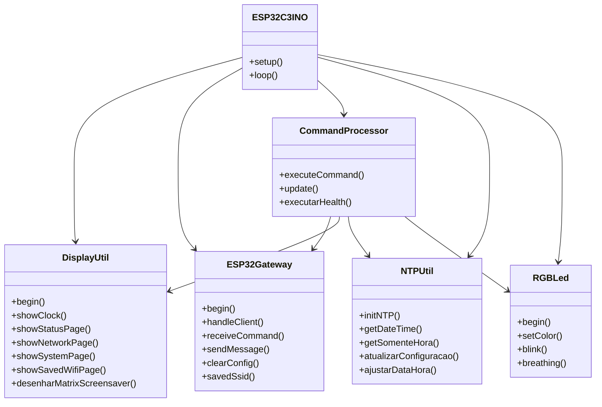
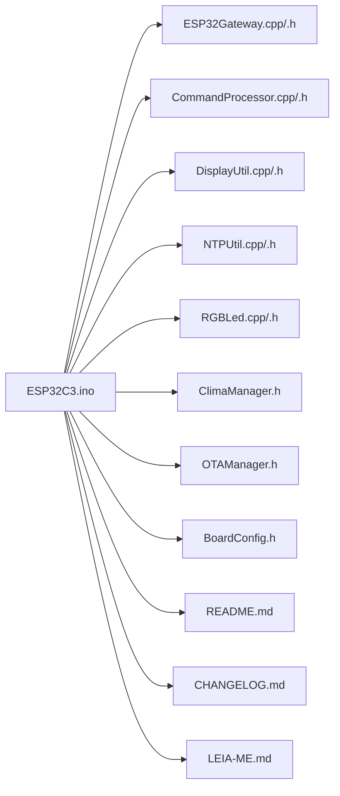

# ESP32-C3 Gateway


Gateway para **ESP32-C3** com display TFT 1.44", portal Wi‑Fi, console UDP, NTP, clima, OTA e feedback visual por LED RGB. O projeto foi organizado para ficar mais claro no GitHub, com documentação prática, mapa de arquivos, visão de arquitetura e um changelog detalhado.

> Ideal para automação embarcada, painel local, controle remoto via rede e monitoramento rápido do dispositivo.

## Destaques

- **Tela TFT 1.44"** com páginas de relógio, status, rede, sistema e redes salvas
- **Portal Wi‑Fi** com até 5 redes persistentes e lista circular
- **Console UDP** para comandos remotos
- **NTP com fuso e DST** persistidos em flash
- **Clima via Open-Meteo** com atualização periódica
- **LED RGB** com estados, blink e breathing
- **OTA** quando conectado como estação
- **Botões físicos** para navegação e ações longas
- **Modo economia** com deep sleep via comando `desliga`

## Visão geral do sistema

```mermaid
flowchart TD
    A[Alimentação / Reset] --> B[ESP32-C3]
    B --> C[Display TFT 1.44\"]
    B --> D[LED RGB]
    B --> E[Wi-Fi STA/AP]
    B --> F[UDP Console]
    B --> G[Portal HTTP]
    B --> H[NTP]
    B --> I[Clima]
    B --> J[OTA]
    B --> K[Botões físicos]

    E -->|Rede salva| L[Conexão automática]
    E -->|Sem rede| M[AP ESP32_C3_CONFIG]
    G --> N[/info]
    G --> O[/wifi]
    F --> P[CommandProcessor]
    H --> Q[Hora local]
    I --> R[Temperatura e condição]
    P --> D
    P --> C
```

## Arquitetura dos módulos



## Estrutura do repositório



## Funcionalidades

### Interface no display

- Relógio principal com data, hora e progresso visual
- Página de status com CPU, RAM, uptime e NTP
- Página de rede com SSID, IP, canal, RSSI e MAC
- Página do sistema com chip, memória e firmware
- Página de redes salvas com slot atual e conectada
- Tela de console para respostas de comandos
- Screensaver estilo matrix após inatividade

### Conectividade

- Conexão automática à melhor rede salva disponível
- Fallback para modo AP: `ESP32_C3_CONFIG`
- Servidor HTTP com:
  - `/info`
  - `/wifi`
- Recebimento de comandos por UDP
- Atualização OTA quando em modo STA conectado

### Energia e operação

- `desliga` coloca o dispositivo em deep sleep
- LED indica estados operacionais
- Botões físicos permitem navegação e ações críticas

## Comandos UDP

### Sistema

- `help`
- `info`
- `status`
- `uptime`
- `reason`
- `version`
- `build`
- `alive`
- `reboot`
- `desliga`
- `temp`
- `cpu`
- `ram`
- `flash`
- `chip_info`
- `health`

### Rede

- `net_info`
- `mac`
- `reset_wifi`
- `rssi`
- `ip`
- `ssid`
- `channel`
- `wifi_status`

### Horário

- `time`
- `date`
- `ntp_status`
- `set_fuso:X`
- `set_time:AAAA-MM-DD HH:MM:SS`
- `dst_on`
- `dst_off`

### LED

- `led_on`
- `led_off`
- `led_breath`
- `led_pisca:P:I`
- `led_blink:I`

### Clima

- `clima`
- `clima_age`
- `clima_sync`

## Exemplo rápido de uso

```bash
help
info
status
set_fuso:-3
set_time:2026-10-07 14:30:00
led_blink:500
clima_sync
health
```

## Hardware e pinagem

Conforme o código atual:

| Sinal | GPIO |
|---|---:|
| LCD CS | 2 |
| LCD DC | 0 |
| LCD RESET | 5 |
| LCD MOSI | 4 |
| LCD SCK | 3 |
| RGB LED | 11 |
| Botão Página | 8 |
| Botão BOOT | 9 |
| Botão Usuário | 10 |

## Como compilar no Arduino IDE

1. Instale **ESP32 by Espressif Systems** na série 3.x
2. Selecione **ESP32C3 Dev Module**
3. Ative **USB CDC On Boot** se quiser serial pela USB nativa
4. Use um esquema de partições com OTA
5. Instale **GFX Library for Arduino (Arduino_GFX)**
6. Abra `ESP32C3.ino` mantendo todos os arquivos juntos na mesma pasta

## Dependências principais

- `WiFi.h`
- `Preferences.h`
- `time.h`
- `Arduino_GFX`
- `Open-Meteo` via `ClimaManager`
- suporte nativo do core ESP32 para OTA e rede

## Fluxo de operação

```mermaid
sequenceDiagram
    participant User as Usuário
    participant Btn as Botões
    participant Loop as loop()
    participant GW as ESP32Gateway
    participant CMD as CommandProcessor
    participant DISP as DisplayUtil

    User->>Btn: Pressiona botão
    Btn->>Loop: Atualiza página / ação
    User->>GW: Envia comando UDP
    GW->>CMD: executa comando
    CMD->>DISP: imprime resposta
    CMD->>GW: responde via UDP
    Loop->>DISP: renderiza tela atual
```

## Changelog

Veja o arquivo [CHANGELOG.md](CHANGELOG.md) para um histórico completo e documentado das mudanças.

## Versão premium para GitHub

Este repositório agora inclui uma apresentação mais rica para GitHub, com:

- badges no topo
- diagramas Mermaid
- blocos de arquitetura
- organização orientada a visitantes
- descrição clara de recursos e uso

## Contribuição

Pull requests e melhorias são bem-vindos. Se quiser, posso também transformar isso em um fluxo de contribuição com issue templates e guia de desenvolvimento.

## Licença

Nenhuma licença foi definida ainda.
