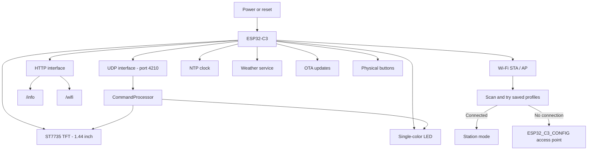
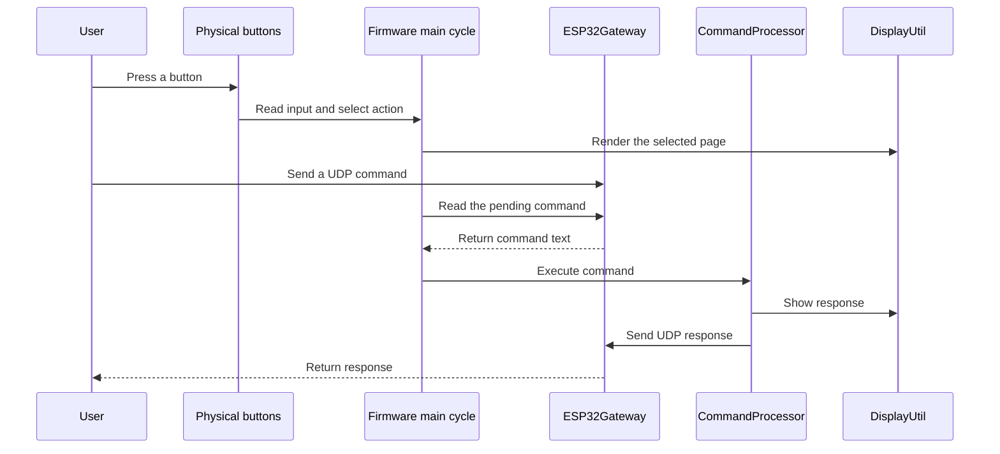
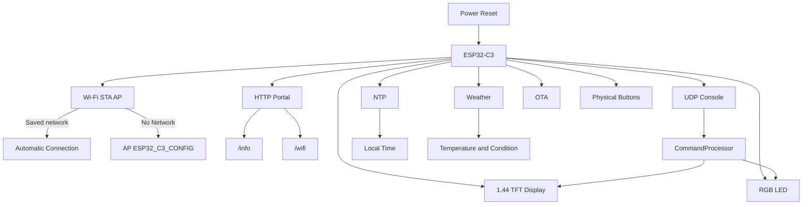
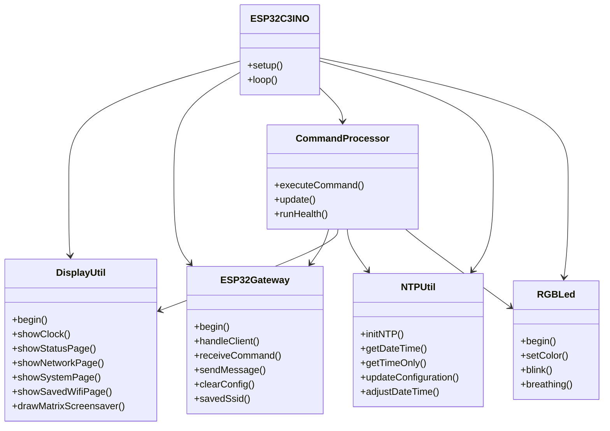
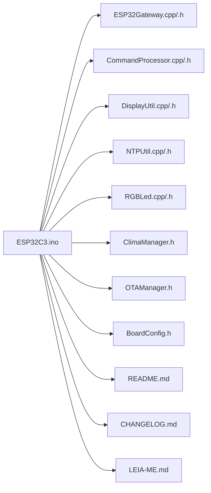
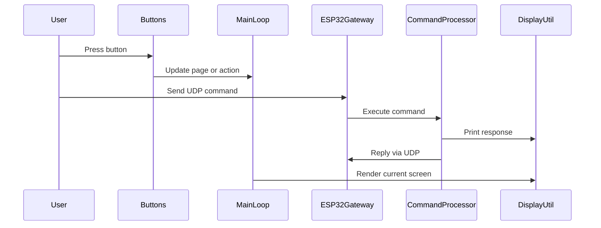

<<<<<<< HEAD
# ESP32-C3 Wi-Fi Gateway

**A compact network gateway with a 1.44-inch display, persistent Wi-Fi profiles, UDP commands, and OTA updates.**

[Quick start](#quick-start) · [Wi-Fi profiles](#wi-fi-profiles) · [Commands](#udp-command-reference) · [Hardware](#hardware) · [Changelog](CHANGELOG.md)

## Overview

This firmware targets an **ESP32-C3 board with a 128 × 128 ST7735 TFT and a single-color status LED**. It combines local monitoring with browser-based configuration and a lightweight UDP command interface.

| Capability | Implementation |
|---|---|
| Wi-Fi configuration | Five persistent SSID/password profiles in a circular list |
| Startup connection | Scans for saved networks, tries visible matches, falls back to AP |
| Web interface | Device information at `/info`; profile management at `/wifi` |
| Local interface | Clock, status, network, system, and saved-profile pages |
| Signal monitoring | Adaptive signal bars and a thin RSSI history trace |
| Timekeeping | NTP, configurable UTC offset, daylight-saving adjustment, manual setting |
| Weather | Open-Meteo current conditions for Porto Alegre |
| Remote control | UDP commands on port 4210 |
| Firmware updates | ArduinoOTA over Wi-Fi |
| Power management | Deep sleep through the `desliga` command |

The implementation does not include Ethernet, SD storage, PSRAM commands, or an RGB LED. The historical `RGBLed` class name remains, but controls the board's single-color LED.

## Architecture



## Interaction flow



## Quick start

1. Keep `ESP32C3.ino` and all accompanying `.h` and `.cpp` files in a directory named `ESP32C3`.
2. Install **esp32 by Espressif Systems 3.x** in Arduino IDE.
3. Install **GFX Library for Arduino (Arduino_GFX)**.
4. Select **ESP32C3 Dev Module** and the correct serial port. Enable **USB CDC On Boot** when using the native USB serial monitor.
5. Select the flash size that matches your board and an OTA-compatible partition scheme. The supplied schematic identifies a 16 MB W25Q128 device; verify the physical board revision.
6. Build and upload over USB. Set the serial monitor to **115200 baud**.

Wi-Fi, HTTP, Preferences, NTP, and OTA libraries are provided by the ESP32 board package. SdFat and Adafruit_NeoPixel are not required.

### First connection

If no saved network connects, join **ESP32_C3_CONFIG** and open **http://192.168.4.1**. Save your network credentials; the device restarts and searches for saved networks.

Once connected, use the IP shown on the display:

- `http://DEVICE_IP/info` — device and network information.
- `http://DEVICE_IP/wifi` — saved profiles and network registration.

## Wi-Fi profiles

The device stores up to five SSIDs and passwords in persistent flash storage. New profiles follow **1 → 2 → 3 → 4 → 5 → 1**. When the list is full, the next registration replaces the indicated slot. Registering an existing SSID updates its password without advancing the cursor.

At startup, the firmware scans nearby networks and attempts visible saved profiles in circular order, allowing approximately ten seconds per connection attempt. If none connects, it starts the configuration AP. Profiles and the cursor survive restarts and deep sleep.

Hidden networks are not discovered by the current scan. Switching between saved SSIDs is performed at startup, not continuously during operation.

## Display and controls

The interface is rotated 90 degrees counterclockwise. Auxiliary pages return to the clock after 30 seconds; UDP responses appear in the console for ten seconds. The screensaver starts after 15 minutes of inactivity.

| Control | Action |
|---|---|
| Key1 · GPIO8 | Advance to the next page when pressed |
| BOOT · GPIO9 | Advance to the next page when pressed |
| Key2 · GPIO10 · short press | Advance to the next page when released |
| Key2 · hold 3 seconds, then release | Restart |
| Key2 · hold 10 seconds, then release | Erase saved Wi-Fi profiles and restart |
| RESET | Restart, including recovery from deep sleep |

Do not hold BOOT while powering on or resetting: it selects the firmware download mode.

### Signal visualization

The header bars and green trace use actual RSSI readings, sampled approximately once per second. The history contains 50 samples. An adaptive scale with a minimum span of 8 dBm makes small changes visible. Bars indicate recent relative variation rather than an absolute connection-quality rating. Stable RSSI produces a stable display.

## UDP command reference

Send command text to the device IP on **UDP port 4210**. Replies return to the sender's address and port. Command names remain unchanged for compatibility with existing clients.

| Category | Commands |
|---|---|
| General | `help`, `info`, `status`, `uptime`, `reason`, `version`, `build`, `alive` |
| Hardware | `temp`, `cpu`, `ram`, `flash`, `chip_info`, `health` |
| Network | `net_info`, `mac`, `rssi`, `ip`, `ssid`, `channel`, `wifi_status` |
| Network reset | `reset_wifi` |
| Time | `time`, `date`, `ntp_status`, `set_fuso:X`, `set_time:YYYY-MM-DD HH:MM:SS`, `dst_on`, `dst_off` |
| LED | `led_on`, `led_off`, `led_breath`, `led_pisca:P:I`, `led_blink:I` |
| Weather | `clima`, `clima_age`, `clima_sync` |
| Power | `reboot`, `desliga` |

- `set_fuso:X`: UTC offset from −12 to +14; default −3.
- `set_time:2026-10-07 14:30:00`: set local time manually. NTP may replace it during a later synchronization.
- `led_pisca:P:I`: 1–100 pulses, with an interval of 1–5000 milliseconds.
- `led_blink:I`: continuous blinking, with an interval of 50–60000 milliseconds.
- `desliga`: enter deep sleep until RESET or a power cycle.

Example client:

```python
import socket

with socket.socket(socket.AF_INET, socket.SOCK_DGRAM) as client:
    client.settimeout(5)
    client.sendto(b"status", ("192.168.1.100", 4210))
    try:
        while True:
            data, _ = client.recvfrom(4096)
            print(data.decode("utf-8", errors="replace"))
    except socket.timeout:
        pass
```

Replace the example IP with the device address. Commands such as weather refresh may take longer than this client's timeout.

## Weather and OTA

Weather coordinates are configured in `ClimaManager.h`. Successful synchronization selects a 15-minute interval; the unsynchronized state uses a one-minute retry interval. `clima_age` reports time since the last update attempt, not necessarily the last successful response.

OTA uses the hostname **ESP32-C3-Gateway** after Wi-Fi connects. Perform the initial upload over USB, use OTA-compatible partitions, and ensure the computer can reach the device over the network. Update progress appears on the display.

## Deep sleep and battery use

`desliga` sends a response, stops Wi-Fi and LED activity, turns off the LCD controller, and enters deep sleep without a wake timer. Saved profiles are retained. Wake the device using **RESET** or a power cycle.

Key1, Key2, and BOOT cannot wake this implementation from deep sleep. The display **backlight remains powered** because it is wired directly to 3.3 V. Firmware reduces processor consumption but does not remove power from the entire board. Turning off the backlight requires a hardware change; battery consumption must be measured on the actual board.

## Hardware

| Signal | GPIO |
|---|---:|
| LCD CS | 2 |
| LCD DC | 0 |
| LCD reset | 5 |
| LCD MOSI | 4 |
| LCD clock | 3 |
| Single-color LED | 11 |
| Key1 | 8 |
| BOOT | 9 |
| Key2 | 10 |
| USB D− / D+ | 18 / 19 |

The display uses software SPI. `BoardConfig.h` defines pins, panel dimensions, offsets, and rotation. The current panel uses offsets 2/3; different revisions may require adjustment.

## Project structure

| File | Responsibility |
|---|---|
| `ESP32C3.ino` | Startup, button handling, page navigation, main loop |
| `BoardConfig.h` | Board and display configuration |
| `ESP32Gateway.*` | Wi-Fi profiles, HTTP routes, UDP communication |
| `CommandProcessor.*` | Command dispatch and diagnostics |
| `DisplayUtil.*` | Pages and RSSI visualization |
| `NTPUtil.*` | Clock, UTC offset, manual adjustment |
| `ClimaManager.h` | Weather requests |
| `OTAManager.h` | OTA handling |
| `RGBLed.*` | Single-color LED control |

## Security and validation

The AP is open; HTTP configuration, UDP commands, and OTA do not have authentication configured. The weather HTTPS client uses `setInsecure()` and does not validate certificates. Use a trusted network and assess these settings before exposing the device beyond it.

Wi-Fi connection and firmware operation were confirmed by the user on an earlier revision. Later changes received static review; a complete build, hardware regression test, and current-consumption measurements have not been recorded for the latest package.

Replace the complete source set when upgrading to avoid mixing incompatible headers and implementations.

## Contributing

Include the board revision, ESP32 package version, library versions, reproduction steps, and full error output when reporting an issue. Remove passwords and private information from logs.

No license is assigned by this documentation. Follow the repository's actual license, if provided.

## Network monitor and daily forecast

Seven pages are available through K1 (next) and K2 (previous). The new network
monitor reports Wi-Fi disconnects, cumulative offline time, the three latest
connection events and 24 gateway ICMP results. An asynchronous one-shot ping runs
approximately every five seconds with a one-second timeout. Red graph samples
represent timeouts; green samples represent measured round-trip time. A gateway
that filters ICMP may time out while Wi-Fi remains connected. These measurements
do not test Internet availability. History is held in RAM and resets on reboot.

The daily forecast page displays today's minimum and maximum temperature and
maximum precipitation probability for Porto Alegre, Brazil. Open-Meteo data is
refreshed with the existing weather service every 15 minutes. Valid cached data
and its age remain visible after refresh failures; missing values are not shown
as zero. Weather HTTP requests remain synchronous with three-second connection
and read timeouts. Auxiliary pages return to the clock after 30 seconds.

API references: [Espressif ICMP Echo](https://docs.espressif.com/projects/esp-idf/en/latest/esp32/api-reference/protocols/icmp_echo.html)
and [Open-Meteo Forecast API](https://open-meteo.com/en/docs).
=======
# ESP32-C3 Gateway


Gateway for **ESP32-C3** with a 1.44" TFT display, Wi‑Fi portal, UDP console, NTP, weather, OTA, and visual feedback through an RGB LED. The project has been organized to be clearer on GitHub, with complete documentation and architecture diagrams.

> Ideal for embedded automation, local dashboards, remote network control, and quick device monitoring.

## Highlights

- **1.44" TFT display** with clock, status, network, system, and saved networks pages
- **Wi‑Fi portal** with up to 5 persistent networks and circular list management
- **UDP console** for remote commands
- **NTP with timezone and DST** persisted in flash
- **Weather via Open-Meteo** with periodic updates
- **RGB LED** with status indication, blink, and breathing effects
- **OTA** when connected in station mode
- **Physical buttons** for navigation and long-press actions
- **Power-saving mode** with deep sleep via `desliga` command

## System Overview

# System Architecture



## Description

- **ESP32-C3** is the central controller.
- **TFT Display** shows status,

## Module Architecture



## Repository Structure



## Features

### Display Interface

- Main clock screen with date, time, and visual progress
- Status page with CPU, RAM, uptime, and NTP
- Network page with SSID, IP, channel, RSSI, and MAC
- System page with chip, memory, and firmware
- Saved networks page with active slot and connected network
- Console screen for command responses
- Matrix-style screensaver after inactivity

### Connectivity

- Automatic connection to the best available saved network
- Fallback to AP mode: `ESP32_C3_CONFIG`
- HTTP server with:
  - `/info`
  - `/wifi`
- UDP command reception
- OTA updates when connected in STA mode

### Power and Operation

- `desliga` puts the device into deep sleep
- LED indicates operating states
- Physical buttons enable navigation and critical actions

## UDP Commands

### System

- `help`
- `info`
- `status`
- `uptime`
- `reason`
- `version`
- `build`
- `alive`
- `reboot`
- `desliga`
- `temp`
- `cpu`
- `ram`
- `flash`
- `chip_info`
- `health`

### Network

- `net_info`
- `mac`
- `reset_wifi`
- `rssi`
- `ip`
- `ssid`
- `channel`
- `wifi_status`

### Time

- `time`
- `date`
- `ntp_status`
- `set_fuso:X`
- `set_time:YYYY-MM-DD HH:MM:SS`
- `dst_on`
- `dst_off`

### LED

- `led_on`
- `led_off`
- `led_breath`
- `led_pisca:P:I`
- `led_blink:I`

### Weather

- `clima`
- `clima_age`
- `clima_sync`

## Quick Usage Example

```bash
help
info
status
set_fuso:-3
set_time:2026-10-07 14:30:00
led_blink:500
clima_sync
health
```

## Hardware and Pinout

According to the current code:

| Signal | GPIO |
|---|---:|
| LCD CS | 2 |
| LCD DC | 0 |
| LCD RESET | 5 |
| LCD MOSI | 4 |
| LCD SCK | 3 |
| RGB LED | 11 |
| Page Button | 8 |
| BOOT Button | 9 |
| User Button | 10 |

## How to Compile in Arduino IDE

1. Install **ESP32 by Espressif Systems** (3.x series)
2. Select **ESP32C3 Dev Module**
3. Enable **USB CDC On Boot** if you want serial over native USB
4. Use a partition scheme with OTA support
5. Install **GFX Library for Arduino (Arduino_GFX)**
6. Open `ESP32C3.ino`, keeping all files together in the same folder

## Main Dependencies

- `WiFi.h`
- `Preferences.h`
- `time.h`
- `Arduino_GFX`
- `Open-Meteo` via `ClimaManager`
- Native ESP32 core support for OTA and networking

## Operational Flow



## Changelog

See [CHANGELOG.md](CHANGELOG.md) for a complete and documented change history.

## Premium GitHub Presentation

This repository now includes a richer GitHub presentation with:

- top badges
- Mermaid diagrams
- architecture blocks
- visitor-oriented organization
- clear feature and usage descriptions

## Contributing

Pull requests and improvements are welcome. If you want, I can also turn this into a contribution workflow with issue templates and a development guide.

## License

No license has been defined yet.
>>>>>>> c80b416886e9ea5370d0c6a4fab140ddd3e75724
