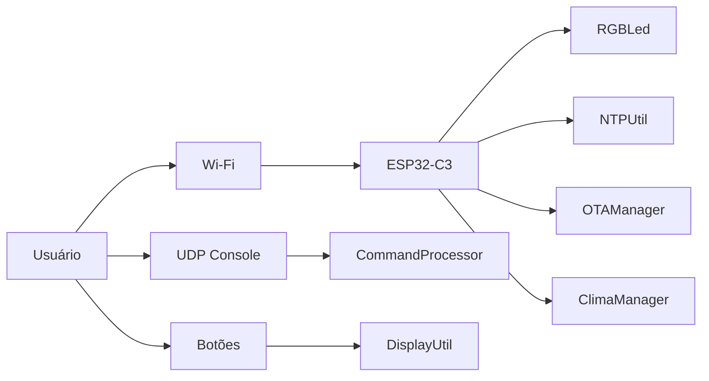

# ESP32-C3 Gateway Premium

> Uma versão premium, mais enxuta e impactante, do README para destaque no GitHub.

## Resumo

O **ESP32-C3 Gateway** é um firmware embarcado para ESP32-C3 com display TFT, portal Wi‑Fi, console UDP, NTP, clima, OTA e feedback por LED RGB.

## Principais pontos

- Interface visual com páginas de relógio, rede, sistema e status
- Portal de configuração Wi‑Fi com múltiplas redes
- Comandos UDP para operação remota
- Sincronização NTP com fuso e DST persistidos
- Clima atualizado via rede
- OTA quando a placa está conectada
- Botões físicos com navegação e ações longas
- Modo deep sleep por comando remoto

## Arquitetura visual

## O que este firmware entrega

- Experiência visual pronta para tela pequena
- Operação remota por rede local
- Diagnóstico rápido do sistema
- Gestão de Wi‑Fi em slots persistentes
- Interface elegante para demonstração em GitHub

## Destaque GitHub

Este README premium foi pensado para:

- visitantes do repositório
- documentação de portfólio
- apresentação de projeto embarcado
- leitura rápida com apelo visual

## Sugestão de uso

Se quiser, esta versão pode ser usada como:

- `README.md` principal
- `README.premium.md` como vitrine
- base para página de apresentação no GitHub
